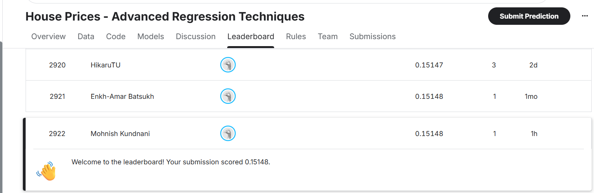
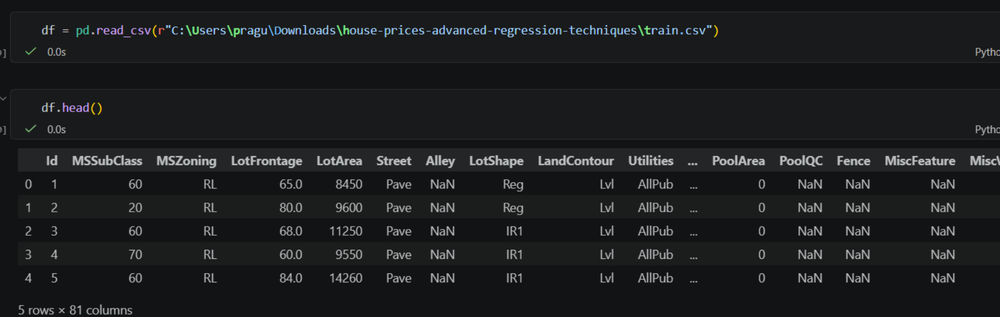
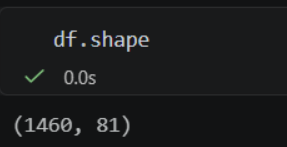
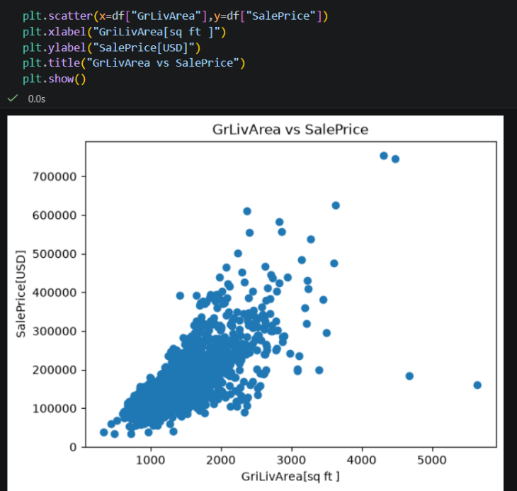

# 🏠 House Price Prediction Using Ridge Regression
### 🏆 Kaggle Ranking

The model was  evaluated on the Kaggle House Prices competition. The Kaggle submission achieved the following ranking:


## 📌 Project Overview

This project uses Machine Learning to predict house sale prices based on different property characteristics. The project is based on the **House Prices: Advanced Regression Techniques** dataset from Kaggle.

The main objective is to analyze the housing data, perform Exploratory Data Analysis (EDA), preprocess numerical and categorical features, and build a **Ridge Regression** model for predicting house prices.

---

## 🎯 Objective

The primary goal of this project is to:

- Understand the factors affecting house prices.
- Perform Exploratory Data Analysis on housing features.
- Handle missing values and categorical variables.
- Prepare the data for Machine Learning.
- Build a Ridge Regression model.
- Tune the model using GridSearchCV.
- Evaluate the model using Mean Absolute Error (MAE).
- Predict house sale prices for unseen data.

---

## 📊 Dataset

The dataset used is the **House Prices: Advanced Regression Techniques** dataset from Kaggle.

The training dataset contains:

- **1,460 rows**
- **81 columns**
- Target variable: `SalePrice`

The dataset contains information about different aspects of houses such as:

- Overall quality
- Living area
- Garage area
- Basement area
- Masonry veneer area
- Number of rooms
- Year built
- Neighborhood
- Garage characteristics
- Pool area
- And many other property features

### Dataset Preview



### Dataset Shape


---

## 🔍 Exploratory Data Analysis

Exploratory Data Analysis was performed to understand the distribution of variables, relationships between features and house prices, and the presence of outliers.

### Sale Price Distribution

The `SalePrice` variable was analyzed using descriptive statistics and visualization.

The dataset contains house prices ranging from **$34,900 to $755,000**, with a mean sale price of approximately **$180,921**.


---

### GrLivArea vs SalePrice

`GrLivArea` represents the above-ground living area of a house.

The scatter plot shows a clear positive relationship between living area and sale price. In general, houses with larger living areas tend to have higher sale prices.



---

### Garage Area Distribution

The distribution of `GarageArea` was analyzed to understand the typical garage sizes in the dataset.

Most houses have garage areas concentrated around the middle range, while a smaller number of houses have very large garages.


---

### Masonry Veneer Area Distribution

The `MasVnrArea` feature represents the masonry veneer area of the property.

The distribution is highly concentrated toward smaller values, with fewer houses having large masonry veneer areas.


---

### MasVnrArea vs SalePrice

The relationship between masonry veneer area and sale price was also investigated.

The plot indicates that properties with larger masonry veneer areas can have higher sale prices, although the relationship is not as strong as features such as overall living area.


---

## 🧹 Data Preprocessing

Before training the model, the dataset needs to be converted into a format suitable for Machine Learning.

The preprocessing pipeline includes:

- Separating features and target variable.
- Splitting the dataset into training and testing sets.
- Handling missing numerical values using `SimpleImputer`.
- Handling categorical values.
- Encoding categorical variables using `OneHotEncoder`.
- Scaling numerical features using `StandardScaler`.
- Combining preprocessing steps using `ColumnTransformer`.

This approach ensures that the same preprocessing operations are consistently applied to both training and testing data.

---

## ✂️ Train-Test Split

The target variable is:

```python
target = "SalePrice"